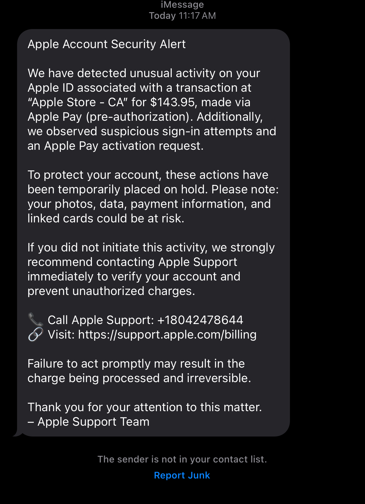

# Phishing-sms-analysis-
Phishing SMS threat analysis and SOC response simulation
# Phishing SMS Analysis – Apple Support Scam

This project analyzes a real-world phishing SMS message pretending to be from Apple Support. The message attempts to trick users into calling a fake support number and visiting a suspicious link to “verify” their account.

---

## 📱 Scam Message Screenshot

---

## 🚩 Red Flags Identified

- Urgent language and scare tactics ("Failure to act promptly…")
- Suspicious phone number pretending to be Apple Support
- Potentially spoofed support link
- Unverified sender (iMessage doesn't show this as official Apple ID)
- Grammar and structure inconsistent with Apple’s actual support alerts

---

## 🎯 Attacker Goal

The likely objective is **credential harvesting** or **credit card theft** by:
- Tricking victims into calling the number
- Directing them to a fake Apple support portal

---

## 🧠 Analyst Response

If seen in a corporate SOC setting:

- **Alert classification**: Phishing attempt (SMS-based)
- **Severity**: Medium to High (depending on user interaction)
- **Recommended actions**:
  - Notify affected users
  - Block associated domains/phone numbers
  - Update phishing detection rules
  - Conduct user awareness training

---

## 🧭 MITRE ATT&CK Mapping

| Technique ID | Technique Name                  | Description                              |
|--------------|----------------------------------|------------------------------------------|
| T1566.001    | Phishing: Spearphishing via SMS | Delivery of fraudulent messages to users |
| T1586        | Compromise Accounts             | Attacker likely attempting account takeover |

---

## 📁 Files

- `phishing_sms_analysis.md` – Detailed breakdown of the message (coming soon)
- `apple_phishing_sms.jpg` – Screenshot of the actual phishing SMS
- *(Optional)* `alert_simulation.log` – Mock SIEM log
- *(Optional)* `user_awareness_email.md` – Sample internal user notification

---

## 💬 Summary

This case study highlights the importance of phishing awareness and real-time alert triage for SOC analysts. Even SMS-based scams can lead to serious credential or financial compromise when not properly handled.

---
